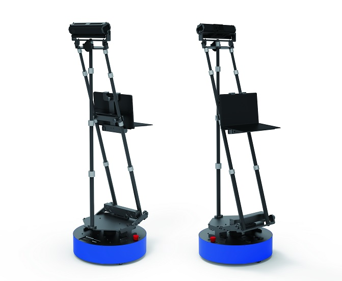
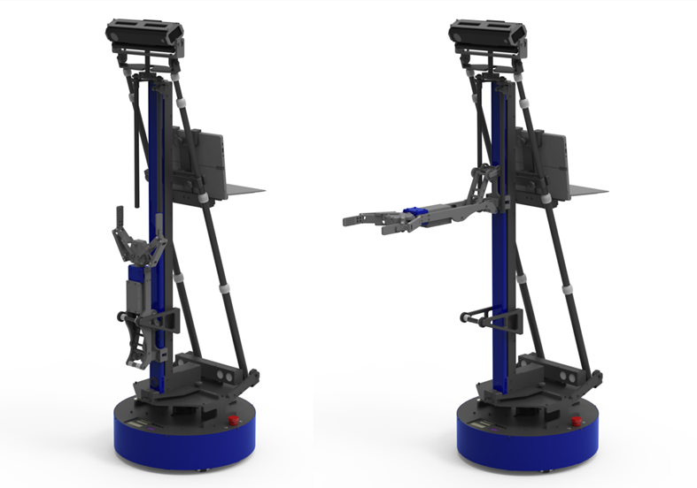
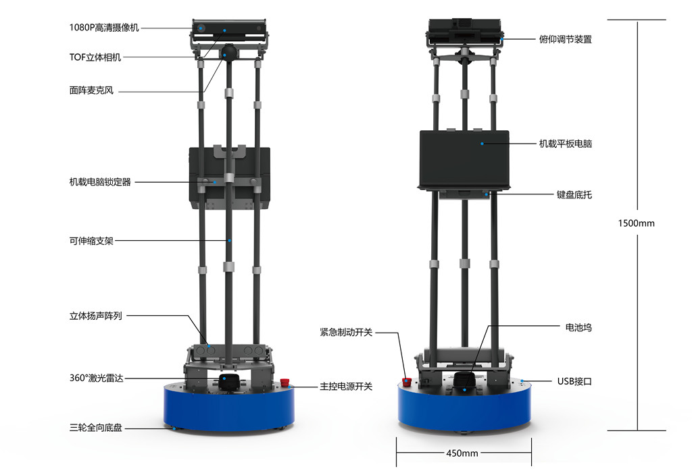
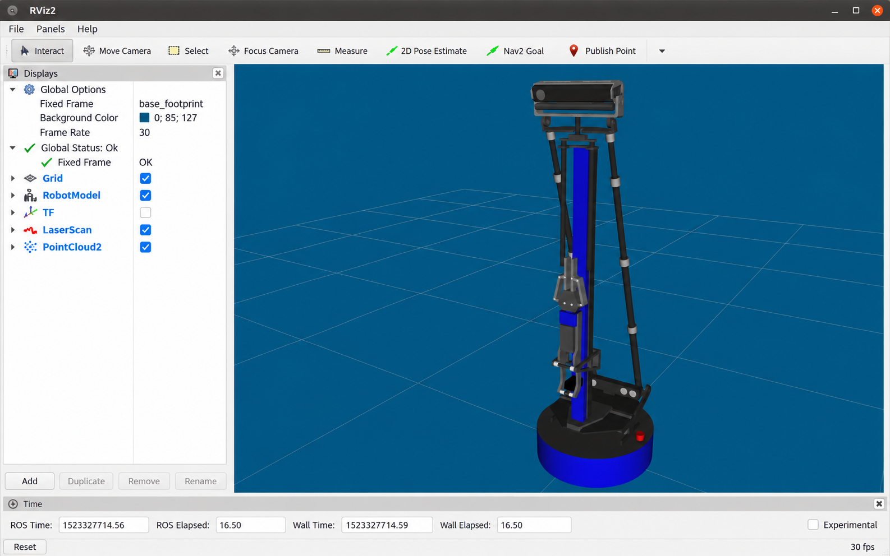
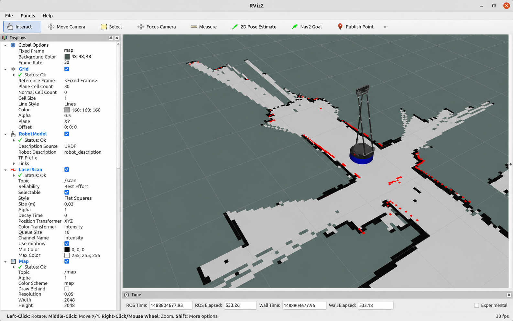
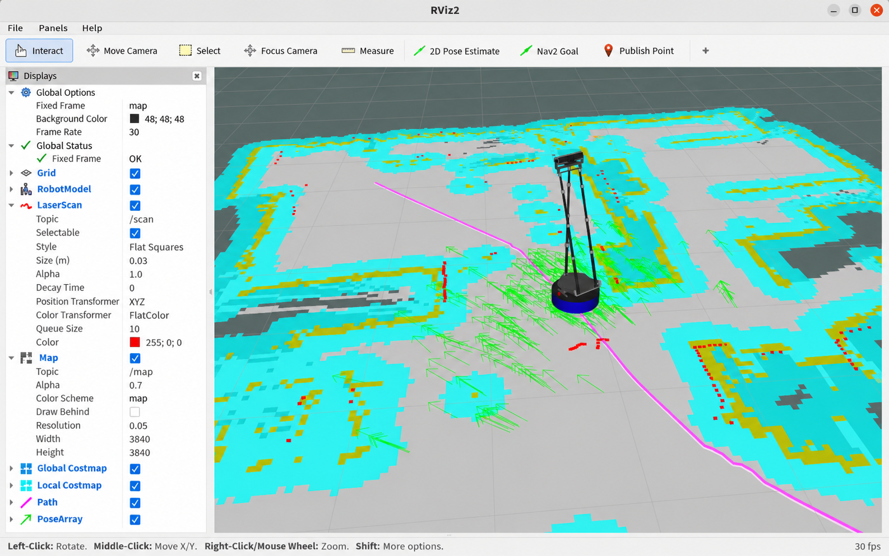
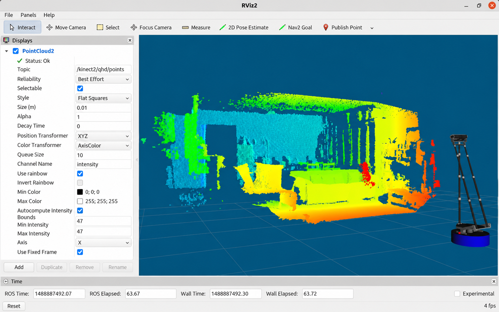

<h1 align="center">启智 ROS2 机器人</h1>

<p align="center">实物机器人驱动 · 感知与导航 · 机械臂控制 · 实验示例</p>
<p align="center"><b>Ubuntu 22.04 · ROS2 Humble · C++ / Python</b></p>

| 启智机器人实物 | 机械臂版本 |
| :---: | :---: |
|  |  |

<p align="center">
  <a href="#使用步骤">使用步骤</a> ·
  <a href="#功能特性">功能特性</a> ·
  <a href="#rviz-功能展示">RViz 功能展示</a> ·
  <a href="#常用启动方式">常用启动方式</a> ·
  <a href="#实验示例">实验示例</a>
</p>

## 平台介绍

启智机器人是北京六部工坊科技有限公司面向机器人教学和算法开发的硬件平台，配备全向移动底盘、编码器里程计、激光雷达、IMU、Kinect2，以及可扩展的升降机械臂和夹爪。

本项目提供 ROS2 驱动、机器人模型、传感器接口、实物实验示例和抓取行为节点，支持从基础运动控制到建图、导航、视觉和语音应用的开发。

## 硬件结构



## 使用步骤

### 1. 准备系统

安装 **Ubuntu 22.04** 和 **ROS2 Humble Desktop**，安装方法见 [ROS2 官方说明](https://docs.ros.org/en/humble/Installation/Ubuntu-Install-Debs.html)。打开终端，准备源码获取与构建工具：

```bash
sudo apt update
sudo apt install -y git python3-colcon-common-extensions
source /opt/ros/humble/setup.bash
```

### 2. 获取配套源码

下面以 `~/ros2_ws` 为工作空间示例；使用其他名称时，把命令中的工作空间路径替换为实际路径。

```bash
mkdir -p ~/ros2_ws/src
cd ~/ros2_ws/src
git clone https://github.com/6-robot/wpb_home_ros2.git
git clone https://github.com/6-robot/wp_map_tools.git
git clone https://github.com/6-robot/wpr_simulation2.git
git clone https://github.com/6-robot/wp_speech
```

语音功能由独立的 [wp_speech](https://github.com/6-robot/wp_speech) 提供，以上命令将其克隆到同一个 `src` 中。获取全部源码后，再执行统一安装脚本。

准备完成后，目录结构如下。各项目应使用配套版本。

```text
ros2_ws/
└── src/
    ├── wpb_home_ros2/
    ├── wp_map_tools/
    ├── wpr_simulation2/
    └── wp_speech/
```

### 3. 安装依赖并编译

使用 Kinect2 前，先安装 **libfreenect2 开发库和头文件**，安装方法见 [libfreenect2 的 Linux 安装说明](https://github.com/OpenKinect/libfreenect2#linux)。Kinect2 需要独立供电并接入 USB 3.0。

统一脚本安装导航、视觉、音频等依赖，下载中英文识别与 TTS 模型，并编译整个工作空间。以普通用户执行，脚本会在安装系统依赖时请求 sudo 密码：

```bash
cd ~/ros2_ws/src/wpb_home_ros2
bash wpb_home_bringup/scripts/install_for_humble.sh
```

语音模型下载需要网络，模型保存在当前用户的缓存目录中：

```text
~/.cache/vosk/vosk-model-small-cn-0.22
~/.cache/vosk/vosk-model-small-en-us-0.15
~/.cache/sherpa-onnx/vits-melo-tts-zh_en
```

修改源码后，在工作空间根目录重新编译：

```bash
cd ~/ros2_ws
source /opt/ros/humble/setup.bash
colcon build --symlink-install
```

### 4. 设置设备权限

```bash
cd ~/ros2_ws/src/wpb_home_ros2
bash wpb_home_bringup/scripts/create_udev_rules.sh
```

重新插拔底盘、雷达与 Kinect2，检查设备是否被识别：

```bash
ls -l /dev/ftdi /dev/rplidar
lsusb
arecord -l
```

`/dev/ftdi` 为底盘串口，`/dev/rplidar` 为雷达串口；`arecord -l` 用于查看 Kinect2 麦克风。设备规则对应配套硬件，使用其他设备型号时需调整规则和启动参数。

### 5. 加载工作空间

每个新终端运行节点前，先加载环境：

```bash
source ~/ros2_ws/install/setup.bash
```

## 软件包结构

| 软件包 | 内容 |
| --- | --- |
| [wpb_home_description](wpb_home_description/) | 机器人 URDF 模型与网格资源 |
| [wpb_home_bringup](wpb_home_bringup/) | 底盘、机械臂和硬件接口，设备规则与启动文件 |
| [wpb_home_tutorials](wpb_home_tutorials/) | 实验一至二十的参考程序、配套启动入口和 RViz 配置 |
| [wpb_home_behaviors](wpb_home_behaviors/) | 三维物体检测与抓取行为节点 |
| [kinect2_ros2](kinect2_ros2/) | Kinect2 图像、深度配准、点云、标定与 RTAB-Map 示例 |

配套工作空间还需包含 `wp_map_tools`、`wpr_simulation2` 和独立的 `wp_speech`。

## 功能特性

| 功能 | 实现与接口 |
| --- | --- |
| 机器人模型 | URDF、关节状态与 TF，支持 RViz2 显示 |
| 底盘控制与里程计 | `/cmd_vel` 全向运动控制，`/odom` 里程计及底盘 TF |
| IMU 姿态 | `/imu/data` 提供姿态、角速度与线加速度，支持 IMU 开关 |
| 扩展硬件接口 | AD 采样、数字输入/输出及声源方向查询 |
| 三维视觉 | Kinect2 彩色、红外、深度图像及 SD / QHD XYZRGB 点云 |
| 环境建图 | SLAM Toolbox 二维建图，RTAB-Map RGB-D 建图示例 |
| 自主导航 | Nav2、AMCL、地图定位、目标导航和航点导航 |
| 图像与物体检测 | 图像显示、HSV 定位、二维人脸检测和桌面物体三维定位 |
| 机械臂与抓取 | 升降与夹爪控制，物体检测、对准和抓取行为 |
| 语音交互 | 独立 `wp_speech` 提供 Vosk 离线中英文识别和中英文 TTS |
| 综合应用 | 导航到取物点、检测与抓取，再导航到递送点 |

## RViz 功能展示

以下展示图由机器人已有的 RViz 截图经 imagegen 修改，用于功能示意。实际运行界面以 RViz2 为准。点击图片可查看大图。

| 机器人模型与机械臂 | SLAM 二维建图 |
| :---: | :---: |
| [](media/rviz_model_edited.png) | [](media/rviz_slam_edited.png) |
| 查看机器人 URDF 模型、升降机械臂与夹爪结构。 | 显示环境栅格地图与当前扫描，观察建图结果。 |

| 自主导航与路径规划 | Kinect2 三维点云 |
| :---: | :---: |
| [](media/rviz_navigation_edited.png) | [](media/rviz_pointcloud_edited.png) |

- **自主导航与路径规划**：显示定位粒子、障碍物代价地图与导航规划路径。
- **Kinect2 三维点云**：显示 `/kinect2/qhd/points`，图中按坐标着色以呈现空间结构。

## 常用启动方式

以下入口按功能选择运行。切换到另一组硬件启动入口前，结束当前组中的驱动进程，避免多个节点同时打开同一设备。

**查看机器人模型**

```bash
source ~/ros2_ws/install/setup.bash
ros2 launch wpb_home_bringup urdf.launch.py gui:=true
```

**启动底盘与雷达**

```bash
source ~/ros2_ws/install/setup.bash
ros2 launch wpb_home_bringup base_lidar.launch.py
```

**查看 Kinect2 图像与点云**

```bash
source ~/ros2_ws/install/setup.bash
ros2 launch wpb_home_bringup kinect_test.launch.py
```

该入口启动底盘、机器人模型、Kinect2 和 RViz2。需要单独启动相机时，使用下面的入口：

```bash
source ~/ros2_ws/install/setup.bash
ros2 launch kinect2_bridge kinect2_bridge.launch.py
```

在 RViz2 中订阅 `/kinect2/sd/points` 或 `/kinect2/qhd/points` 查看彩色点云。

**手柄建图**

```bash
source ~/ros2_ws/install/setup.bash
ros2 launch wpb_home_tutorials slam.launch.py
```

**自主导航**

```bash
source ~/ros2_ws/install/setup.bash
ros2 launch wpb_home_tutorials navigation.launch.py
```

导航前需先保存实际场地地图，方法见下节。在 RViz2 中使用 **2D Pose Estimate** 设置初始位姿，再用 **Nav2 Goal** 设置导航目标。

**中文语音识别与语音合成**

打开一个终端运行中文识别：

```bash
source ~/ros2_ws/install/setup.bash
ros2 launch wp_speech sr_cn.launch.py
```

英文识别使用 `sr_en.launch.py`。保持识别终端运行，新开一个终端启动 TTS：

```bash
source ~/ros2_ws/install/setup.bash
ros2 launch wp_speech tts.launch.py
```

保持上述终端运行，再新开一个终端发送朗读文字：

```bash
source ~/ros2_ws/install/setup.bash
ros2 run wp_speech speak '你好，我是六部工坊启智机器人。Hello, welcome.'
```

## 地图与航点

地图文件统一放在源码包 **`wpb_home_tutorials/maps`** 中，名称为 `map.yaml` 和 `map.pgm`。保持建图节点运行，在新终端中执行：

```bash
cd ~/ros2_ws
map_dir="$(colcon list --base-paths src --packages-select wpb_home_tutorials --paths-only)/maps"
mkdir -p "$map_dir"
source ~/ros2_ws/install/setup.bash
ros2 run nav2_map_server map_saver_cli -f "$map_dir/map" --fmt pgm
colcon build --packages-select wpb_home_tutorials
```

每次新建或更新地图后，重新编译教程包，将地图安装到共享目录。

航点保存在主目录 **`~/waypoint.xml`**，通过 `wp_map_tools` 的 `add_waypoint.launch.py` 编辑、`wp_saver` 保存。

## 实验示例

`wpb_home_tutorials` 包含实验一至二十的参考程序。C++ 源码位于 [examples](wpb_home_tutorials/examples/)，Python 启动示例位于 [launch](wpb_home_tutorials/launch/)，程序与文件采用 `exNN_` 前缀。

每个实验都有独立的 `exNN_bringup.launch.py`，用于启动配套节点。以实验六“IMU 姿态模块”为例，先启动配套节点：

```bash
source ~/ros2_ws/install/setup.bash
ros2 launch wpb_home_tutorials ex06_bringup.launch.py
```

保持配套节点终端运行，新开一个终端运行参考程序：

```bash
source ~/ros2_ws/install/setup.bash
ros2 run wpb_home_tutorials ex06_imu_data
```

其他实验按相同方式选择对应的配套入口与参考程序；地图、航点和物体抓取实验需先完成对应准备步骤。

## 许可证

本仓库采用 [BSD 3-Clause](LICENSE) 许可证。Kinect2 驱动、标定工具及其他第三方组件的许可信息见各自目录。
